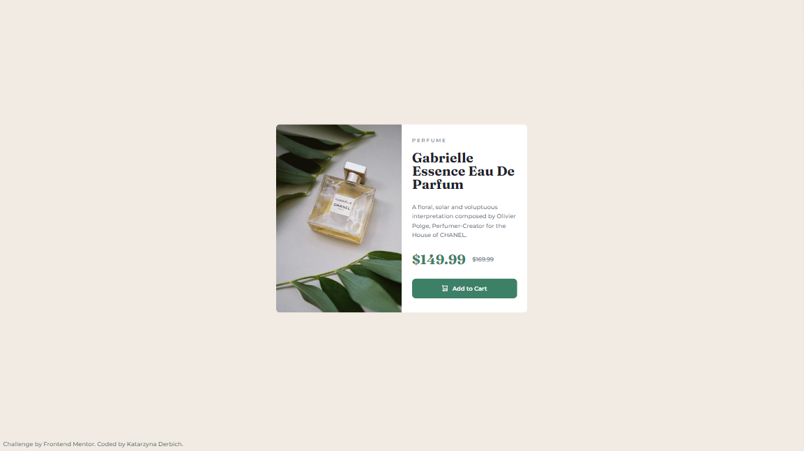

# Frontend Mentor - Product preview card component solution

This is a solution to the [Product preview card component challenge on Frontend Mentor](https://www.frontendmentor.io/challenges/product-preview-card-component-GO7UmttRfa). Frontend Mentor challenges help you improve your coding skills by building realistic projects. 

## Table of contents

- [Overview](#overview)
  - [The challenge](#the-challenge)
  - [Screenshots](#screenshots)
  - [Links](#links)
- [My process](#my-process)
  - [Built with](#built-with)
  - [What I learned](#what-i-learned)
- [Author](#author)

## Overview

### The challenge

Users should be able to:

- View the optimal layout depending on their device's screen size
- See hover and focus states for interactive elements

### Screenshots

- Mobile Solution (375px width):

  

- Desktop Solution (1920px width):

  

### Links

- Solution URL: [GitHub Solution](https://github.com/belie369/frontend-mentor-product-preview-card-component)
- Live Site URL: [GitHub Live](https://belie369.github.io/frontend-mentor-product-preview-card-component/)

## My process

### Built with

- Semantic HTML5 markup
- SASS SCSS
- BEM methodology
- Flexbox
- Mobile-first workflow
- Gulp

### What I learned

- I repeated my knowledge of CSS.

## Author

- Website - [katarzynaderbich.pl](http://katarzynaderbich.pl/)
- Frontend Mentor - [@belie369](https://www.frontendmentor.io/profile/belie369)
- Twitter - [@belie369](https://www.twitter.com/belie369)